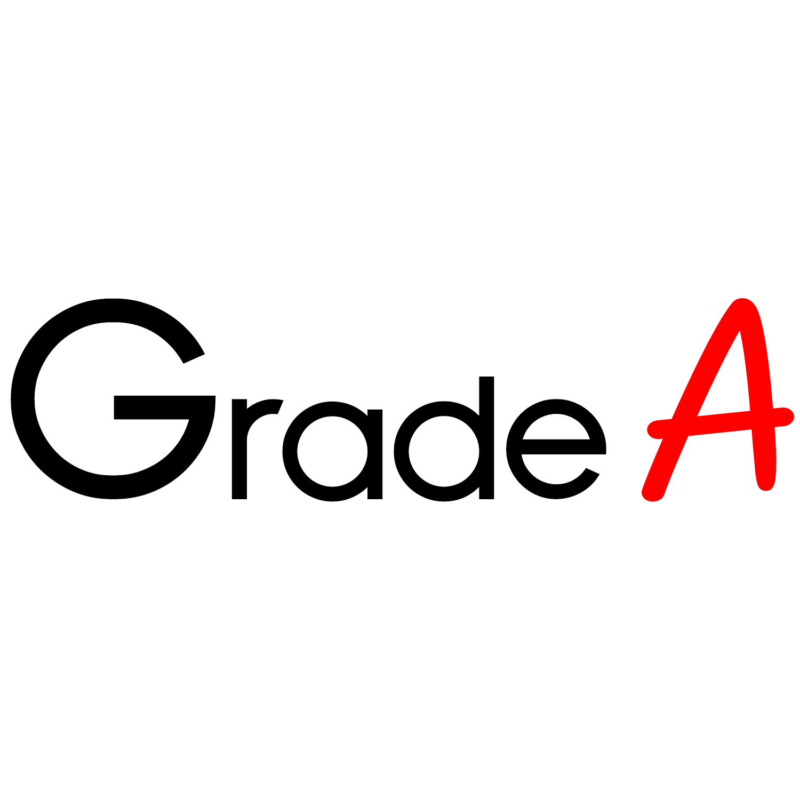

# 🎓 Grade A LMS - Learning Management System



A comprehensive **Learning Management System** built with **ASP.NET Core MVC**, featuring user authentication, role-based access control, and modern responsive design. Perfect for educational institutions to manage students, instructors, courses, and grades efficiently.

---

## ✨ Key Features

### 🔐 **Authentication & Authorization**
- **User Registration & Login** – Secure authentication system  
- **Role-Based Access Control** – Admin, Instructor, and Student roles  
- **Account Management** – Profile management and password security  
- **Access Control** – Different features for different user roles  

### 📊 **Dashboard & Analytics**
- **Interactive Dashboard** – Overview with statistics and recent activities  
- **Role-Specific Views** – Customized dashboard for each user type  
- **Quick Actions** – Fast access to common tasks  

### 👥 **User Management**
- **Students Management** – Complete CRUD operations with search  
- **Instructors Management** – Manage teaching staff and assignments  
- **User Profiles** – Detailed user information and course enrollment  

### 📚 **Academic Management**
- **Courses Management** – Course catalog with instructor assignments  
- **Grades Management** – Grade tracking with automatic letter grade calculation  
- **Student Enrollment** – Course registration and management  
- **Academic Records** – Complete grade history and transcripts  

### 🔍 **Advanced Features**
- **JSON API** – RESTful endpoints for data integration  
- **Search Functionality** – Advanced search across students and courses  
- **Responsive Design** – Mobile-friendly Bootstrap 5 interface  
- **Modern UI** – Clean sidebar navigation with Grade A branding  

---

## 🛠️ Technology Stack
- **Backend**: ASP.NET Core MVC (.NET 8)  
- **Authentication**: ASP.NET Core Identity  
- **Database**: SQL Server with Entity Framework Core  
- **Frontend**: Bootstrap 5, Font Awesome, jQuery  
- **ORM**: Entity Framework Core (Code First)  
- **Security**: Role-based authorization, secure password policies  
- **UI Framework**: Responsive Bootstrap 5 with custom Grade A branding  

---

## 📦 Prerequisites
- **Visual Studio 2022** or later  
- **.NET 8 SDK**  
- **SQL Server** or **SQL Server LocalDB**  

---

## ⚙️ Setup Instructions

### 1. Clone/Extract the Project
```bash
# Extract the project files to your desired location
C:\YourPath\GradeALMS\
